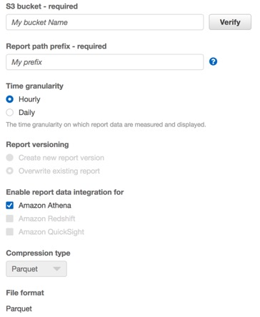
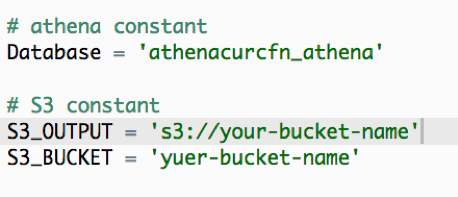
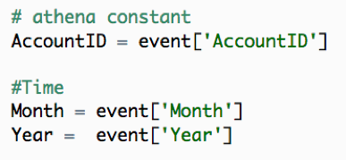
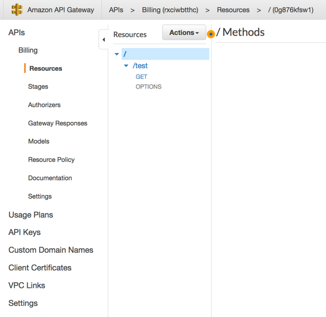
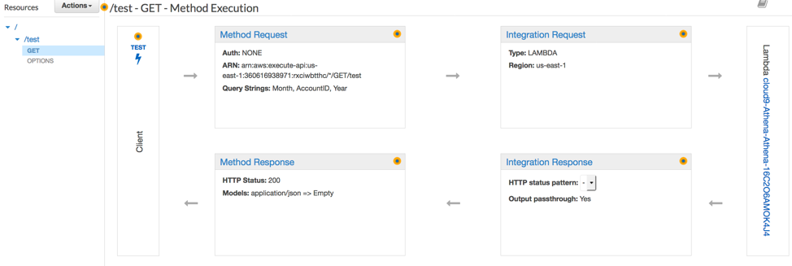
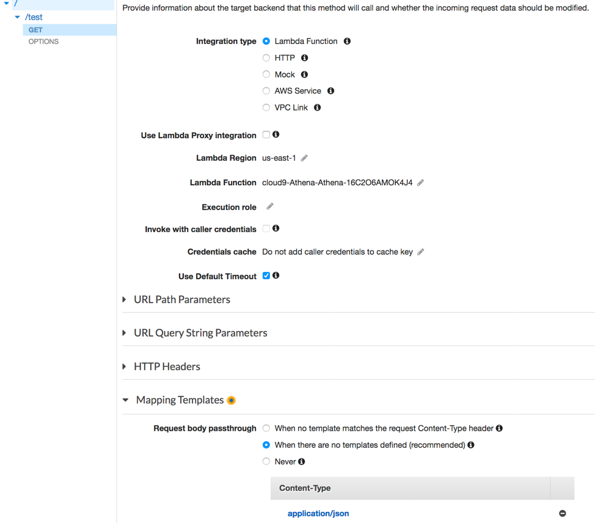
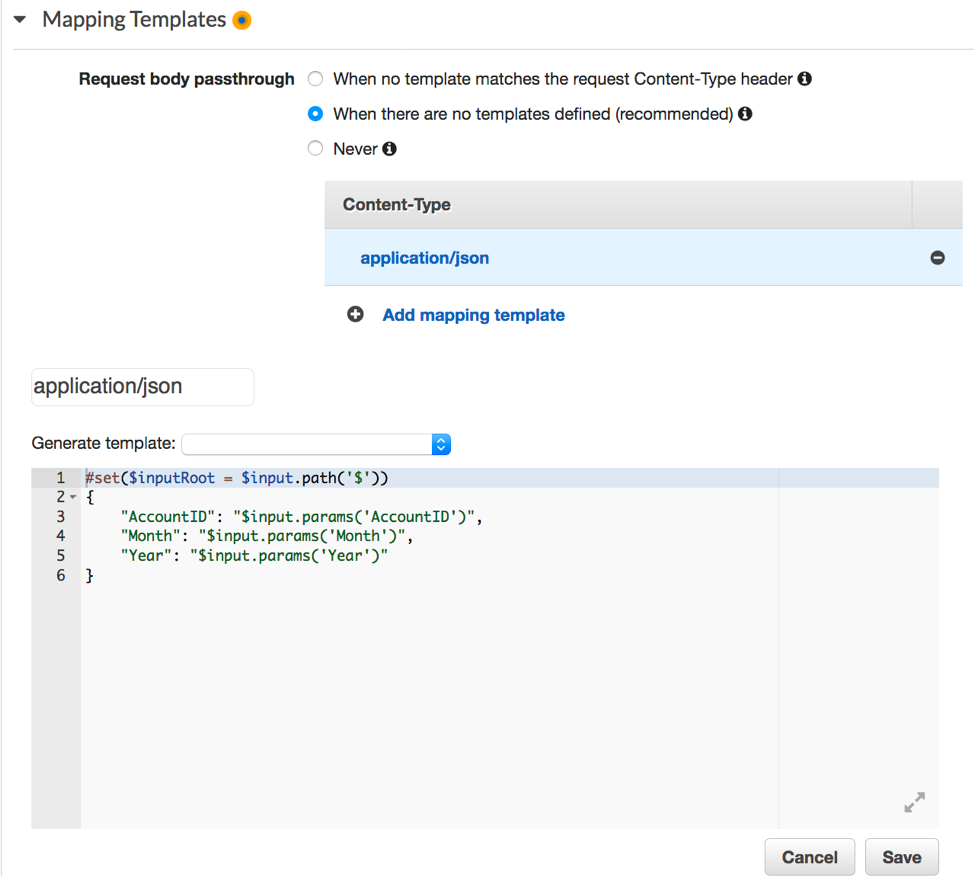
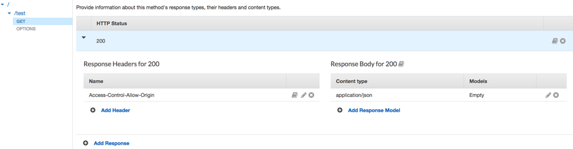
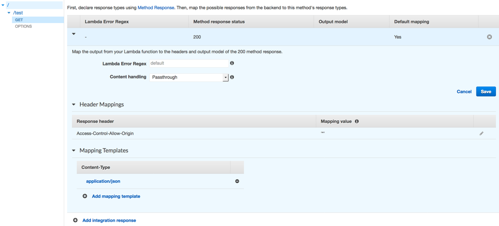

AWS Billing Report API:

1.	Configurar reporte de billing con Athena:  
a.  https://aws.amazon.com/blogs/aws-cost-management/querying-your-aws-cost-and-usage-report-using-amazon-athena/
2.	Definir si se quiere que ajustes a meses previos se reflejen:  
a.	   
3.	Configurar el envío a Athena:  
a.	   
b.	Referencia https://docs.aws.amazon.com/awsaccountbilling/latest/aboutv2/athena.html. 
4.	Crear una función lambda con el contenido siguiente: https://github.com/mpcloud/code/aws-billing-api/blob/master/athena_billing.py  
a.	Ejemplo: https://docs.aws.amazon.com/es_es/toolkit-for-eclipse/v1/user-guide/lambda-tutorial.html. 
5.	Asignar los valores requeridos:  
a.	   
6.	Es necesario contar con el role de IAM previamente creado con el acceso a athena y S3.  
7.	Cear un api en api Gateway y relacionarla con la función lambda previamente creada que pasara los siguientes parámetros:  
a.	   
8.	Creamos un método y recurso:  
a.	   
9.	Configuraremos cada parte para mapear los parámetros que pasaremos en la URL:  
a.	   
b.	Method Request  
i.     
c.	Integration Request  
i.     
ii.    
d.	Integration Response  
i.    
e.	Method Response  
i.    
Los parámetros los recibe de la siguiente manera, por ejemplo: AccountID=Your-Account-ID&Month=12&Year=2018, podemos ir a test y validarlo, por ejemplo la url se vería de la siguiente manera: https://your-url.execute-api.us-east-1.amazonaws.com/Prod/test?AccountID=360616938971&Month=12&Year=2018  

