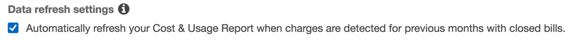
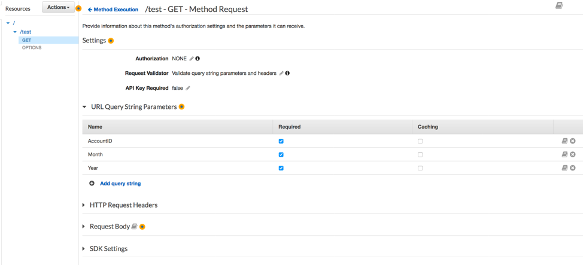

AWS Billing Report API:

1.	Setup billing integration with Athena:  
a.  https://aws.amazon.com/blogs/aws-cost-management/querying-your-aws-cost-and-usage-report-using-amazon-athena/
2.	Define, if required, previous month adjustments:  
a.	   
3.	Configure how we will send data to Athena:  
a.	   
b.	Reference https://docs.aws.amazon.com/awsaccountbilling/latest/aboutv2/athena.html. 
4.	Create a lambda fuction using the sample code: https://github.com/mpcloud/code/aws-billing-api/blob/master/athena_billing.py  
a.	Example on hot to create lambda: https://docs.aws.amazon.com/es_es/toolkit-for-eclipse/v1/user-guide/lambda-tutorial.html. 
5.	Assign the required values:  
a.	   
6.	You need to have a role previously created with access to S3 ans to query Athena.  
7.	Create a ner API in API Gateway and associate the lambda you currently created mapping the parameters to the lambda input:  
a.	   
8.	Create a resource and a Methos in API Gateway:  
a.	   
9.	Setup the example parameters wou will use in the GET Request to the URL:  
a.	   
b.	Method Request  
     
c.	Integration Request  
i.     
ii.     
d.	Integration Response  
    
e.	Method Response  
    
The parameters we defined will be used like this: AccountID=Your-Account-ID&Month=12&Year=2018, we can go to test to validate before deploying, this is an example of how your URL would look like with this example: https://your-url.execute-api.us-east-1.amazonaws.com/Prod/test?AccountID=360616938971&Month=12&Year=2018  

